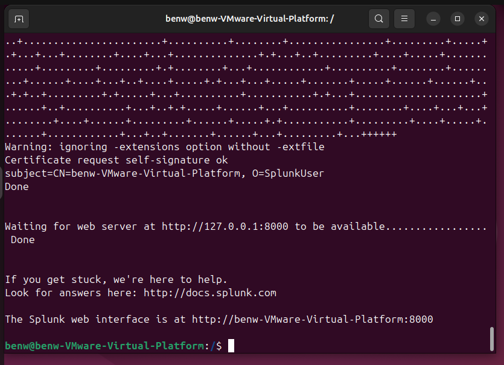
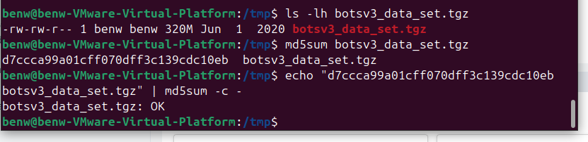
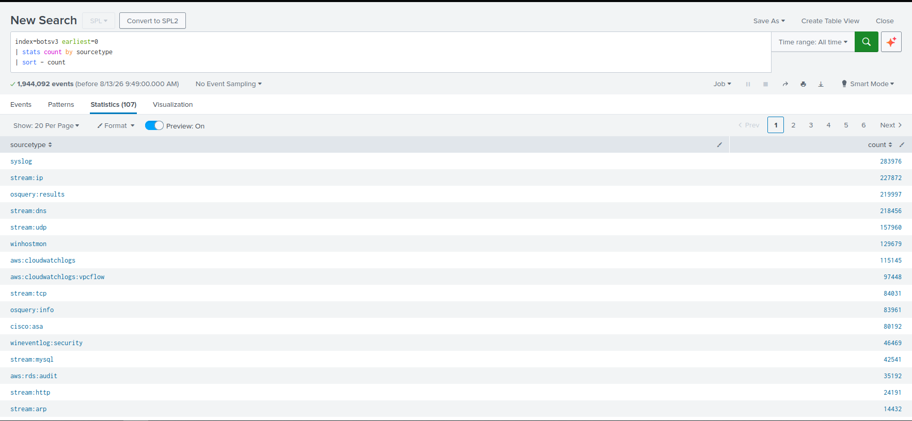
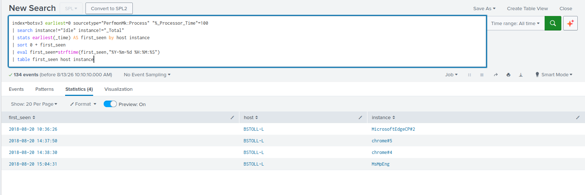
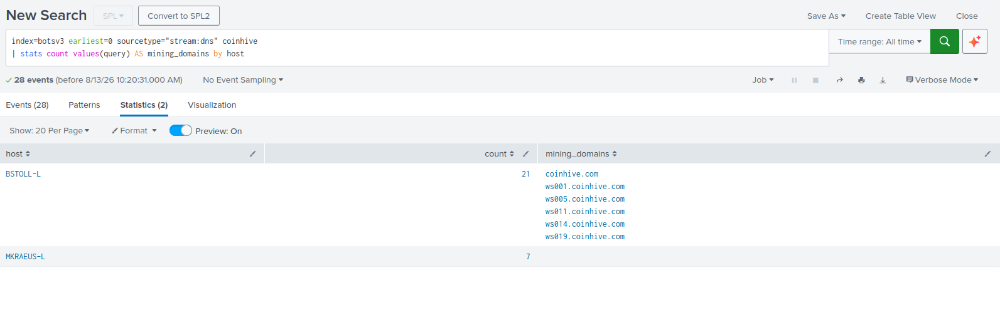
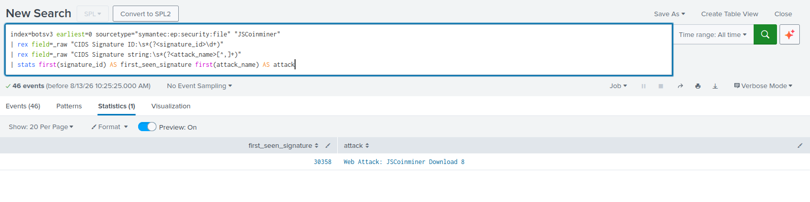
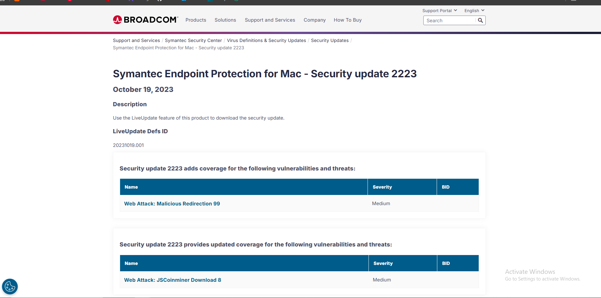
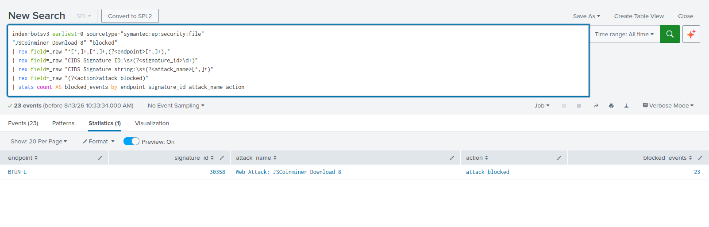

# BOTSv3 Security Investigation

## 1. Introduction
## 2. SOC Roles & Incident Handling Reflection
## 3. Installation & Data Preparation
## 4. Guided Investigation
| Question | Finding |
|---|---|
| Q1 | Second process to reach 100% CPU: `chrome#5` |
| Q2 | Endpoint that actually mined cryptocurrency: `BSTOLL-L` |
| Q3 | Coin-miner signature ID: `30358` |
| Q4 | Attack: `Web Attack: JSCoinminer Download 8` |
| Q5 | Vendor severity: `Medium` |
| Q6 | Endpoint that successfully blocked the threat: `BTUN-L` |

   ### Question 1
#### Question

> A Frothly endpoint exhibits signs of coin-mining activity. What is the name of the second process to reach 100 percent CPU processor utilisation?

#### Answer

**`chrome#5`**

#### Investigation

Windows process performance data was examined using the `PerfmonMk:Process` sourcetype.

```spl
index=botsv3 earliest=0 sourcetype="PerfmonMk:Process" "%_Processor_Time"=100
| search instance!="Idle" instance!="_Total"
| stats earliest(_time) AS first_seen by host instance
| sort 0 + first_seen
| eval first_seen=strftime(first_seen,"%Y-%m-%d %H:%M:%S")
| table first_seen host instance
```

`Idle` and `_Total` were excluded because they represent performance-counter values rather than individual application processes.

The results were:

| Order | Process | First Seen |
|---|---|---|
| 1 | `MicrosoftEdgeCP#2` | 10:36:26 |
| 2 | `chrome#5` | 14:37:50 |
| 3 | `chrome#4` | 14:38:30 |
| 4 | `MsMpEng` | 15:04:31 |

The second process to reach 100% CPU utilisation was therefore **`chrome#5`**. Supporting evidence is provided in **Appendix A, Figure A3**.

#### SOC Relevance

Cryptocurrency mining is computationally intensive, making abnormal CPU utilisation a useful behavioural indicator. However, high CPU utilisation alone is not proof of malicious activity. This result therefore generated a hypothesis that required correlation with additional telemetry.


   ### Question 2
#### Question

> What is the short hostname of the only Frothly endpoint to actually mine Monero cryptocurrency?

#### Answer

**`BSTOLL-L`**

#### Investigation

DNS telemetry was searched for activity associated with CoinHive infrastructure:

```spl
index=botsv3 earliest=0 sourcetype="stream:dns" coinhive
| stats count values(query) AS mining_domains by host
```

The search identified CoinHive-related requests, including domains such as:

```text
coinhive.com
ws001.coinhive.com
ws005.coinhive.com
```

The DNS results included activity from more than one system, so DNS data alone was not treated as proof that an endpoint had successfully mined cryptocurrency.

The key finding was correlation with Question 1. `BSTOLL-L` was associated with both CoinHive-related network activity and browser processes reaching 100% processor utilisation. This combination provided substantially stronger evidence that `BSTOLL-L` was the endpoint on which mining had actually occurred. This form of multi-source correlation is also central to Splunk's analysis of the BOTSv3 cryptomining scenario (Splunk, 2024).

Supporting evidence is provided in **Appendix A, Figure A4**.

#### SOC Relevance

This demonstrates why SOC investigations should avoid relying on a single indicator. A DNS lookup can occur without successful exploitation, while high CPU utilisation may have a legitimate cause. Correlating independent network and endpoint indicators increases confidence in the conclusion.

   ### Question 3
#### Question

> What is the first-seen signature ID of the coin miner threat according to Frothly's Symantec Endpoint Protection data?

#### Answer

**`30358`**

#### Investigation

SEP events containing JSCoinminer detections were searched. Because the historical SEP add-on was unavailable, the required fields were extracted from `_raw`.

```spl
index=botsv3 earliest=0 sourcetype="symantec:ep:security:file" "JSCoinminer"
| rex field=_raw "CIDS Signature ID:\s*(?<signature_id>\d+)"
| rex field=_raw "CIDS Signature string:\s*(?<attack_name>[^,]+)"
| stats first(signature_id) AS first_seen_signature first(attack_name) AS attack
```

The result returned:

```text
first_seen_signature    attack
30358                   Web Attack: JSCoinminer Download 8
```

The required signature ID was therefore **`30358`**. Evidence is provided in **Appendix A, Figure A5**.

It is important to distinguish Splunk's `first()` event-order function from a strictly chronological `earliest()` calculation. `first()` operates according to search/event order, which is relevant because the exercise specifically directs the investigator towards Splunk's event-order functions (Splunk, n.d.).

#### SOC Relevance

Signature IDs provide a consistent method of correlating security-product detections. Analysts can use them to identify repeated instances of the same threat, conduct vendor research and determine whether multiple alerts are related.

   ### Question 4
#### Question

> What is the name of the attack?

#### Answer

**`Web Attack: JSCoinminer Download 8`**

#### Investigation

The same SEP extraction used in Question 3 returned the CIDS signature string associated with signature ID `30358`:

```text
Web Attack: JSCoinminer Download 8
```

The attack was therefore identified as **Web Attack: JSCoinminer Download 8**. Supporting evidence is shown in **Appendix A, Figure A6**.

#### SOC Relevance

A descriptive threat name gives analysts additional context beyond a numerical signature. This allows further research using vendor intelligence and helps analysts determine appropriate containment and remediation actions.

   ### Question 5
#### Question

> According to Symantec's website, what is the severity of this specific coin miner threat?

#### Answer

**`Medium`**

#### Investigation

The identified SEP signature was checked against official Broadcom/Symantec security information.

Broadcom lists **Web Attack: JSCoinminer Download 8** with a severity classification of **Medium** (Broadcom, 2023).

Evidence from the vendor security-update page is provided in **Appendix A, Figure A7**.

#### SOC Relevance

Vendor severity can support alert triage but should not determine incident priority by itself. Cryptocurrency mining can consume significant organisational resources and indicates execution of unwanted content. The value and sensitivity of the affected endpoint, observed behaviour and effectiveness of existing controls should also influence prioritisation.

   ### Question 6
#### Question

> What is the short hostname of the only Frothly endpoint to show evidence of defeating the cryptocurrency threat?

#### Answer

**`BTUN-L`**

#### Investigation

SEP events were searched specifically for JSCoinminer Download 8 records containing evidence that the activity had been blocked:

```spl
index=botsv3 earliest=0 sourcetype="symantec:ep:security:file"
"JSCoinminer Download 8" "blocked"
| rex field=_raw "^[^,]+,[^,]+,(?<endpoint>[^,]+),"
| rex field=_raw "CIDS Signature ID:\s*(?<signature_id>\d+)"
| rex field=_raw "CIDS Signature string:\s*(?<attack_name>[^,]+)"
| rex field=_raw "(?<action>attack blocked)"
| stats count AS blocked_events by endpoint signature_id attack_name action
```

The result was:

| Field | Result |
|---|---|
| Endpoint | `BTUN-L` |
| Signature ID | `30358` |
| Attack | `Web Attack: JSCoinminer Download 8` |
| Action | `attack blocked` |
| Blocked Events | `23` |

The endpoint showing evidence of successfully defeating the threat was therefore **`BTUN-L`**. Supporting evidence is provided in **Appendix A, Figure A8**.

#### SOC Relevance

This result demonstrates the important distinction between detecting an attack and determining whether it succeeded.

`BSTOLL-L` showed evidence consistent with successful mining, whereas the SEP telemetry from `BTUN-L` explicitly recorded that the attack had been blocked. A SOC analyst must therefore examine the action taken by a security product rather than assuming every detection represents a successful compromise.

## 5. Conclusion
## 6. Video Presentation

## 7. References
Bianco, D. (2024) Hypothesis-driven cryptominer hunting with Peak, Splunk. Available at: https://www.splunk.com/en_us/blog/security/hypothesis-driven-cryptominer-hunting-with-peak.html (Accessed: 11 August 2026). 

Security updates detail (no date) Broadcom Inc. Available at: https://www.broadcom.com/support/security-center/securityupdates/detail?fid=sep&pvid=sep14_2_2&suid=CIDS_Enterprise_SEP_14_2_2-SU224-20231019.061&year=2023 (Accessed: 11 August 2026). 

Splunk (no date) Splunk/botsv3: Splunk boss of the SOC version 3 dataset., GitHub. Available at: https://github.com/splunk/botsv3 (Accessed: 10 August 2026). 

‘Event order functions’, *Splunk Search Reference* (no date) Splunk. Available at: https://help.splunk.com/ (Accessed: 11 August 2026). 

Nelson, A. et al. (2025) Incident response recommendations and considerations for Cybersecurity Risk Management: A CSF 2.0 community profile, CSRC. Available at: https://csrc.nist.gov/pubs/sp/800/61/r3/final (Accessed: 13 August 2026). 


## Appendix A – Investigation Evidence

This appendix contains the supporting evidence collected during the installation, data-validation and investigation stages. Screenshots are referenced from the main report where relevant rather than being embedded throughout the main body.

### Figure A1 – Splunk Enterprise Setup

Successful startup of Splunk Enterprise on the Ubuntu virtual machine. The terminal output confirms that the Splunk web service became available on TCP port `8000`.




### Figure A2 – BOTSv3 Dataset Integrity Verification

Verification of the downloaded `botsv3_data_set.tgz` archive against the MD5 checksum published by Splunk. The result of `botsv3_data_set.tgz: OK` confirms that the downloaded archive matched the expected checksum prior to extraction.




### Figure A3 – BOTSv3 Dataset Validation

Splunk search used to validate that the BOTSv3 dataset had been successfully loaded. The search returned approximately **1.94 million events across 107 sourcetypes**, confirming that the index was available for investigation.




### Figure A4 – Question 1: Processor Utilisation

Splunk results showing the first occurrence of processes reaching 100% CPU utilisation after excluding the `Idle` and `_Total` performance counters. The results identify `chrome#5` as the second process to reach 100% CPU utilisation.




### Figure A5 – Question 2: Cryptocurrency-Mining Endpoint

DNS telemetry showing CoinHive-related activity. The results were correlated with the processor-utilisation findings from Question 1 to identify `BSTOLL-L` as the endpoint showing evidence of successful cryptocurrency-mining activity.




### Figure A6 – Questions 3 and 4: SEP Signature ID and Attack Name

Splunk analysis of Symantec Endpoint Protection telemetry using the `first()` event-order function. The result identifies the first-seen coin-miner threat signature as `30358` and associates it with `Web Attack: JSCoinminer Download 8`.

This single result provides evidence for both **Question 3** and **Question 4**.




### Figure A7 – Question 5: Threat Severity

Official Broadcom/Symantec security-update information showing `Web Attack: JSCoinminer Download 8` with a vendor-assigned severity of **Medium**.




### Figure A8 – Question 6: Successful Threat Prevention

Symantec Endpoint Protection results showing **23 blocked events** associated with signature `30358` on endpoint `BTUN-L`. The result explicitly records the action as `attack blocked`, providing evidence that the endpoint-security control successfully prevented the cryptocurrency-mining threat.


